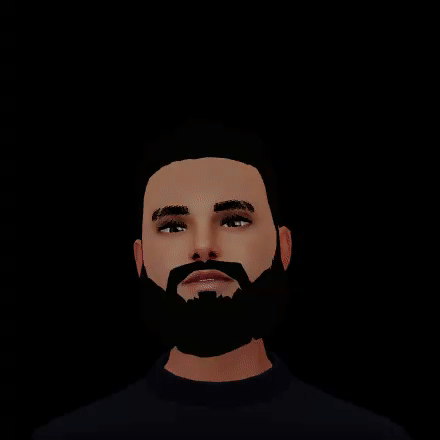
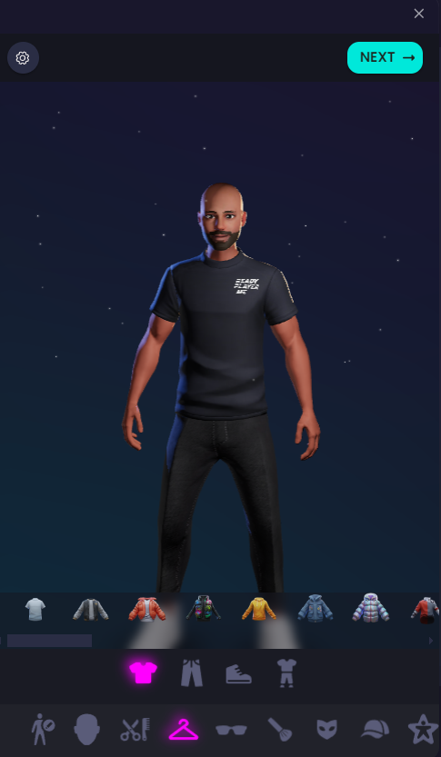
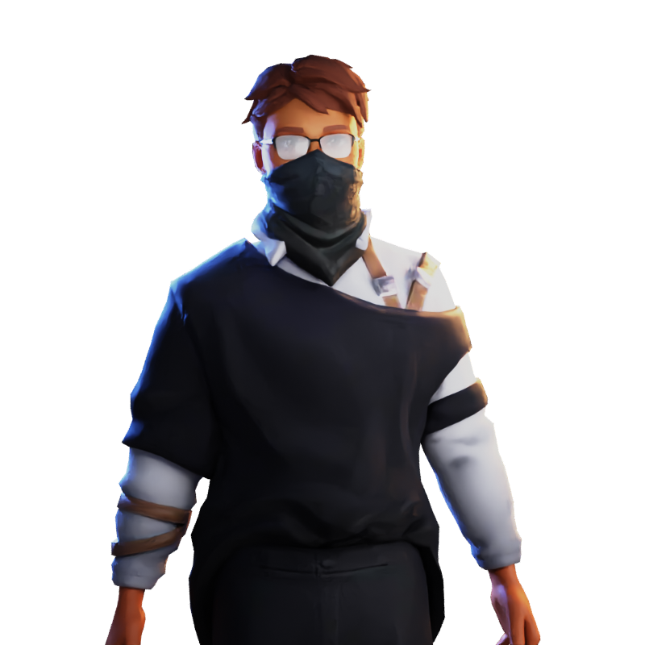

# AmiMoji

AmiMoji is a web application that allows users to create and animate 3D avatars based on their facial movements. Users can capture these animations and save them as GIFs or MP4 videos.

## Technologies Used

- Frontend: Next.js, NextUI
- Backend: Firebase Database
- 3D Rendering: Three.js
- Facial Movement Recognition: Mediapipe

## Features

### Real-time Facial Animation

AmiMoji uses Mediapipe to track facial movements through the user's webcam. This data is then applied to a 3D avatar rendered with Three.js, allowing the avatar to mirror the user's expressions instantly.

### Avatar Customization

Users can customize their avatars with different styles, colors, and accessories. The customization options include hairstyles, outfits, glasses, and more, providing a personalized experience.

### Capture and Export

Once satisfied with their avatar's animation, users can capture the movement and export it as either a GIF or an MP4 video. This feature is accessible directly from the interface, making it easy to share creations on social media or with friends.

### Firebase Integration

Firebase is used for real-time data storage and synchronization. User captured animations are stored securely in Firebase Firestore.

### Responsive Design

The application is designed to be responsive, ensuring a consistent user experience across desktops, tablets, and mobile devices. The interface adapts dynamically to different screen sizes and orientations.

## Screenshots

Recording

Exporting

## Contributing
Contributions are welcome! Please fork the repository, create a branch, and submit pull requests to contribute new features, improvements, or bug fixes.
